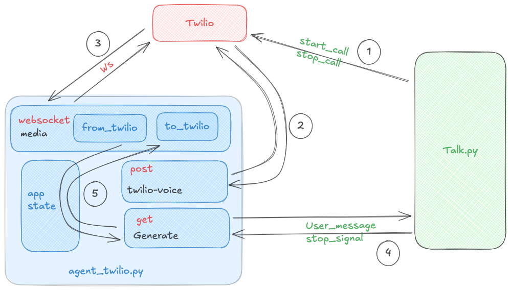

## Twilio Voice with FastAPI, ElevenLabs, and Galtea

This project enables real-time phone conversations using Twilio for call control, FastAPI for the backend, ElevenLabs for Speech-to-Text and Text-to-Speech, and a Galtea-driven simulator to automate test calls.

For a full tutorial on how to use this repository combined with Galtea tests, please refer to the [quickstart](README-Quickstart.md).

### Features
- **Real-time voice**: Handle incoming Twilio calls and stream audio via WebSocket.
- **Speech-to-Text (ElevenLabs)**: Convert caller speech to text.
- **Text-to-Speech (ElevenLabs)**: Synthesize agent replies and stream them back to Twilio.
- **Voice Activity Detection (webrtcvad)**: Detect speech/silence to trigger transcription efficiently.
- **Agent simulator (`talk.py`)**: Place a real Twilio call and orchestrate turns via `/generate`.
- **Safety and resilience**:
  - **SIGINT/SIGTERM handling** in both server and simulator to gracefully end calls.
  - **Automatic Twilio call completion** on failures/timeouts/interrupts.
  - **WebSocket closure** and shutdown signaling to avoid dangling streams.
  - **Talk timeout** to end stalled conversations.

### Important limitation
This implementation supports only one active call/session at a time. Call-specific data is stored in global `app.state` and is reset per session. To support concurrent callers, refactor to keep per-call state keyed by the Twilio `sid`/`streamSid` (e.g., a dictionary of session objects) and avoid mutating shared globals.

### Project Structure
- `agent_twilio.py`: Starts a public web server for Twilio. When a call begins, Twilio sends audio here (webhook/WebSocket), and we can send audio back—this is the call’s inbox/outbox we can program against.
- `talk.py`: Tells Twilio to place a call from `from_number` to `to_number` and then drives the conversation through our endpoint. Instead of a phone’s mic/speaker, it can feed audio/text from our endpoint and read the audio replies from the incoming websocket data from twilio.
- `experiment/experiment.ipynb`: Optional notebook for manual testing.
- `pyproject.toml`: Modern Python project configuration with dependencies.
- `config.yaml`: Configuration file for runtime values (non-secrets).
Below is a flow diagram of how the whole application works - 
<br/>

<div align="center">

**Application Flow Diagram**



</div>

### Requirements and Setup
1) Clone and enter the repo
```bash
git clone <repository_url>
cd Calling-Agent
```

2) Install dependencies using uv (recommended)
```bash
# Quick setup with make
make dev-setup

# Or manual setup:
# Install uv if you haven't already
curl -LsSf https://astral.sh/uv/install.sh | sh

# Create virtual environment and install dependencies
uv sync
```

Alternatively, you can use pip with a virtual environment:
```bash
python -m venv venv
source venv/bin/activate  # On Windows: venv\Scripts\activate
pip install -e .
```

3) Create a `.env` file with required secrets
```bash
TWILIO_ACCOUNT_SID=ACxxxxxxxxxxxxxxxxxxxxxxxxxxxxx
TWILIO_AUTH_TOKEN=your_twilio_auth_token
ELEVENLABS_API_KEY_GAL=your_elevenlabs_api_key
API_KEY=your_internal_api_key_for_generate
GALTEA_API_KEY_DEV=your_galtea_api_key   # needed for talk.py simulator
```

### Running the Server

#### Option 1: Local Development (Recommended)
Start the FastAPI app on port 8001:
```bash
# Using make (recommended)
make run-dev

# Or manually with uv
uv run uvicorn agent_twilio:app --host 0.0.0.0 --port 8001 --reload

# Or with regular venv/pip
source venv/bin/activate  # On Windows: venv\Scripts\activate
uvicorn agent_twilio:app --host 0.0.0.0 --port 8001 --reload
```

#### Option 2: Docker Deployment
Run with Docker Compose (ensure `.env` file is configured):
```bash
# Using make
make docker-compose-up

# Or manually
docker-compose up -d

# Check logs
make docker-logs
```

Or build and run manually:
```bash
make docker-build
make docker-run
```

### Expose Server Publicly
Expose your server publicly for Twilio (requires ngrok installed):
```bash
ngrok http 8001
```
Copy the generated HTTPS forwarding URL (e.g., `https://<subdomain>.ngrok-free.app`).

### Configure Twilio
1) Get the Twilio credentials. Auth token and Account sid.
2) In Twilio Console ➜ Phone Numbers ➜ Active numbers ➜ select your number.
3) Make sure that the number has permission to call `Spain`.

### Driving a Call with the Simulator (`talk.py`)
- The numbers you want to call, the number you want to call from ( your twilio number ), the ngrok link ( remote_url ) through which you exposed your fastapi to public - all these things should now be put in the config.yml.
- You must also create tests and version in the galtea platform and put those ids here as well.
- tests shows how many and which tests ( through index ) you want to run.

- Configure runtime values in `config.yaml` (non-secrets):

```yaml
# config.yaml
remote_url: "https://<your-ngrok>.ngrok-free.app"   # public HTTPS for Twilio webhooks
base_url: "http://localhost:8001"                   # where your FastAPI server runs
from_number: "+12136957366"                         # your Twilio number (E.164)
to_number: "+34960324442"                           # destination number (E.164)
test_id: "zga8cw73ykxtxk0oxkd8q9u4"
version_id: "hwtq29i0jrhosqpukiobu6n4"            
tests: [6,7,8]
asycio_timeout: 120.0                           # client-side wait for transcription/response (s)
request_timeout: 120.0                          # HTTP timeout for /generate calls (s)
talk_timeout: 80                                # server-side idle timeout to end stalled calls (s)
max_turns: 12                                   # hard cap on total dialog turns
agent_goes_first: true                          # if true, agent initiates the conversation
```

- Keep secrets in `.env`: `GALTEA_API_KEY_DEV`, `TWILIO_ACCOUNT_SID`, `TWILIO_AUTH_TOKEN`, and `API_KEY`.

Run it:
```bash
# Using make (recommended)
make run-simulator

# Or manually with uv
uv run python talk.py

# Or with regular venv/pip
source venv/bin/activate  # On Windows: venv\Scripts\activate
python talk.py
```
The simulator will:
- Start a Twilio call with your configured numbers.
- Make a first request to `/generate?first=true` to wait for the caller’s first utterance.
- On subsequent turns, send the agent’s text to synthesize, and wait for the next user transcription.
- On completion or interrupt, update the Twilio call status to `completed`.

### API Overview
- **POST `/twilio-voice`**
  - Twilio webhook for incoming calls. Returns TwiML that starts a bidirectional media stream to `/media`.

- **WebSocket `/media`**
  - Twilio streams u-law audio; the server converts to 16-bit PCM for VAD and STT.
  - ElevenLabs STT is invoked after silence is detected following speech.
  - Outbound TTS is generated via ElevenLabs and streamed back as u-law media frames.
  - A `mark` event named `endOfPlayback` is sent to delineate playback completion.

- **GET `/generate`** (secured via `X-API-KEY`)
  - Query params:
    - `client`: placeholder value required by current interface (not used server-side).
    - `sid`: Twilio call SID for the active call.
    - `first` (bool): if true, wait for first user transcription.
    - `timeout` (float): max seconds to wait before returning `204 No Content`.
    - `input` (str): agent text to synthesize and play to the caller.
    - `talk_timeout` (float): conversation idle timeout (seconds) for the server.
  - Responses:
    - `200`: `{ "response": "..." }` with the latest transcription or termination reason.
    - `204`: No content within the timeout window.

### Safety and Shutdown Behavior
- **Server (`agent_twilio.py`)**
  - Installs handlers for `SIGINT`/`SIGTERM`; sets a global shutdown event.
  - On Twilio `stop` events, server-side errors, WebSocket errors, talk timeout, or shutdown:
    - Signals shutdown, closes the WebSocket when appropriate.
    - Updates the Twilio call to `completed` using the stored `sid`.
  - Uses a configurable `talk_timeout` (default ~50s) to end stalled sessions.

- **Simulator (`talk.py`)**
  - Catches `SIGINT`/`SIGTERM` and ensures the active Twilio call is set to `completed` before exiting.
  - Applies request timeouts when calling `/generate` and exits cleanly on errors/timeouts.

### Tuning and Configuration
- **VAD sensitivity**: Aggressive mode (`3`) is used for webrtcvad.
- **Silence trigger**: `SILENCE_CHUNKS_TRIGGER` defaults to `140`. Increase if you need more post-speech silence before transcription.
- **Sample rate**: Audio is processed at `8000 Hz` mono, 16-bit PCM internally.
- **ElevenLabs**:
  - STT model: `scribe_v1` (example), language: `es` (Spanish).
  - TTS model: `eleven_flash_v2_5`, output: `pcm_8000`, language: `es`.
  - Adjust `voice_id`, language, and model to your use case.

### Troubleshooting
- **Ngrok URL changes**: Update Twilio webhook and `remote_url` in `talk.py` when ngrok restarts.
- **403 from `/generate`**: Ensure the `X-API-KEY` header matches `API_KEY` in `.env`.
- **204 from `/generate`**: A timeout occurred; check VAD thresholds, audio path, or increase `timeout`.
- **No audio**: Confirm that outbound media is being sent and `endOfPlayback` marks are being received.
- **Call ends early**: Check `talk_timeout` and server logs.

### Viewing and managing active Twilio calls
To quickly see how many Twilio calls are active and how to cancel them, open the notebook `experiment/experiment.ipynb`. It includes a section that lists active Twilio calls and demonstrates cancelling them.

## Docker Deployment

### Quick Start with Docker
The application can be easily deployed using Docker and docker-compose:

1) **Setup environment variables**
```bash
# Create .env file (or use the Makefile helper)
make setup-env
# Edit .env with your actual credentials
```

2) **Build and run with docker-compose**
```bash
# Start the application
make docker-compose-up

# Or with development tools (includes ngrok)
make docker-compose-up-dev

# View logs
make logs

# Stop services
make docker-compose-down
```

3) **Alternative: Build and run Docker manually**
```bash
# Build the image
make docker-build

# Run the container
make docker-run
```

### Makefile Commands
The project includes a comprehensive Makefile for easy development and deployment:

```bash
# Development setup
make dev-setup             # Complete setup including .env template
make install               # Install dependencies with uv
make run-dev               # Run with auto-reload
make run-simulator         # Run the talk.py simulator

# Docker deployment
make docker-build          # Build Docker image
make docker-compose-up     # Start with docker-compose
make docker-compose-down   # Stop services
make docker-logs           # View application logs

# Utilities
make health                # Check application health
make clean                 # Clean up temporary files
make clean-docker          # Clean up Docker resources
make help                  # Show all available commands
```

### Deployment Options

#### Local Development
Best for development and testing:
- Fast iteration with auto-reload
- Direct access to logs and debugging
- Easy integration with ngrok for Twilio webhooks

#### Docker Deployment  
Better for production-like environments:
- Containerized and isolated
- Easy deployment and scaling
- Consistent environment across systems
- Built-in health checks and restart policies

### Production Deployment Notes
- The Docker image uses a non-root user for security
- Health checks are included for container orchestration
- Logs directory is mounted for persistent logging
- Environment variables are properly configured via docker-compose
- For production, consider adding:
  - SSL termination (reverse proxy)
  - Proper secrets management (Docker secrets, k8s secrets)
  - Load balancing for multiple instances
  - Monitoring and alerting


